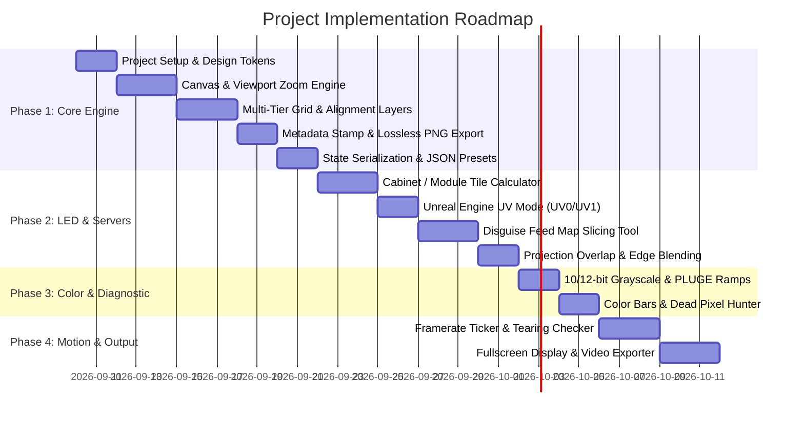
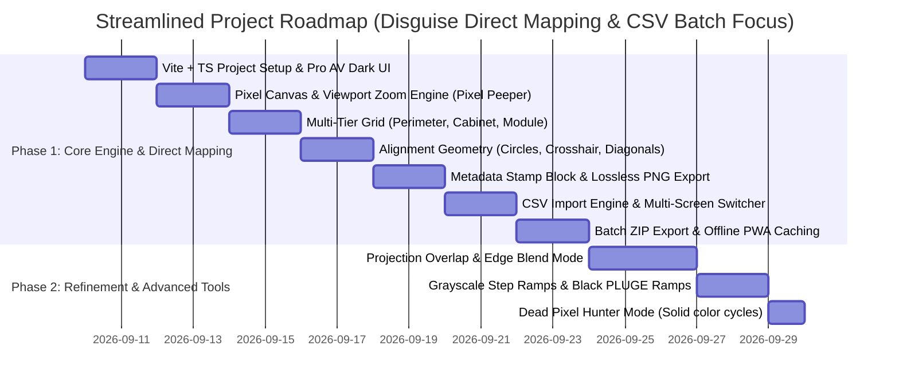

# Test Pattern Generator for LED Walls & Projection Surfaces
## Comprehensive Project Playbook & Architectural Blueprint

---

### Executive Summary

In live events, virtual production (ICVFX), broadcast, and architectural projection mapping, **the test pattern is the single most critical diagnostic and alignment instrument**. It is the ground truth that validates every link in the signal chain: from 3D DCC tools (Unreal Engine, Cinema 4D) to media servers (Disguise d3, Pixera, Resolume), downstream video processors (Brompton Tessera, Megapixel Helios, NovaStar), distribution amplifiers, and finally physical display surfaces (LED panels, projectors).

Historically, video engineers and disguise operators have been forced to choose between:
1. **Rigid built-in server test cards** (which cannot be easily exported as UV templates or content guides for motion designers).
2. **Cloud-based online generators** (like VIOSO's `testpatterngenerator.com`), which are heavily projector-biased, require user accounts to save presets, lack LED cabinet/module awareness, offer zero motion/genlock diagnostic tools, and fail completely in offline venues or air-gapped production networks.
3. **Manual Adobe Illustrator / Photoshop templates**, where technicians manually compute pixel math, place guides, and draw rasters—a tedious, high-friction process prone to disastrous 1-pixel off-by-one errors.

This project aims to build the **ultimate, modern, offline-first, pixel-perfect Test Pattern Generator** tailored specifically for the modern LED volume and projection mapping ecosystem, with first-class workflows for **Disguise (d3)** and **Unreal Engine (nDisplay)**.

---

## 1. What’s Out There: Competitive Analysis & Industry Gripes

To build a tool that technicians will actually love and adopt, we examined the landscape of existing solutions, forums (r/VIDEOENGINEERING, disguise user groups, virtual production communities), and tools like VIOSO TPG, PixlGrid, and hardware generators.

### Existing Tools Breakdown

| Solution | Strengths | Glaring Deficiencies / Gripes |
| :--- | :--- | :--- |
| **VIOSO TPG** (`testpatterngenerator.com`) | Clean web UI; projector overlap/edge-blending calculations; metric mode (pixels per meter); Domemaster dome patterns. | **No LED cabinet/module awareness**; **No Disguise feed map / VFC raster support**; **No Unreal UV gradient (UV0/UV1)**; **Cloud-account walled** (must sign up/log in to save/share presets); **No offline mode** (fails on gig VLANs); **PNG-only export**; **No motion/framerate sync/tearing verification**; **No 10/12-bit HDR patterns**. |
| **PixlGrid** (macOS App) | Purpose-built for LED techs; custom screen sizing; live moving cursor; multi-grid layouts; export for Millumin/Resolume. | **macOS only** (most media server racks and virtual production control stations run Windows 10/11 Enterprise or Linux); closed commercial tool; not easily accessible via browser. |
| **VisualGrid.fr** | Free browser tool; quick simple grids. | Barebones feature set; frequently unmaintained; no export customization or media server integration. |
| **Built-in Disguise (d3) TestPattern Layer** | Native playback inside disguise timeline; direct mapping; resolution readout. | Cannot be exported as an external image template for 3D/Unreal artists; limited pattern customizability; does not help pre-build pixel maps before entering disguise. |
| **Unreal Engine nDisplay Calibration Actor** | Built into UE; verifies viewport cluster tearing. | Complex console-command setup (`nDisplay.Calibration.Pattern`); requires spinning up the entire UE project and cluster just to test physical displays; lacks graphic design export. |
| **Adobe Illustrator / Photoshop (Manual)** | Total graphic freedom; vector precision. | **Massive time sink**; manual math calculations; high probability of 1px scaling/offset errors; painful to re-export when an LED wall dimension changes on site by 1 cabinet. |
| **Hardware Generators** (Murideo, Phabrix, ImagePro) | Broadcast-grade timing; rock-solid SDI/HDMI outputs. | Extremely expensive ($2,000–$15,000+); restricted to standard broadcast rasters (1080p, 4K UHD); **cannot generate arbitrary non-standard aspect ratios** (e.g., 7680×1080, 5120×1440, curved L-shaped walls). |

---

### Top User Gripes from Technicians in the Field

1. **"The Internet Problem"**: Production environments (arenas, film stages, festival fields) frequently have zero public internet or run on strict, air-gapped VLANs. Any tool requiring online cloud logins or external asset fetching is a non-starter on show site.
2. **The "1-Pixel Blur" / Aliasing Trap**: When previewing test patterns in browsers or photo viewers, OS-level DPI scaling (125%, 150% on Windows laptops) or canvas downsampling blurs 1-pixel hairline borders, making techs think their processor is scaling when it’s actually the viewer.
3. **Lack of True LED Physical Hierarchy**: An LED wall is not just a rectangle of pixels. It is an assembly of **Processors -> Ports -> Cabinets (e.g. 500×500mm) -> Modules (e.g. 250×250mm) -> Pixels (e.g. 2.6mm pitch)**. Technicians need patterns that clearly delineate cabinet seams vs. module seams vs. port boundaries.
4. **Huge Canvas Crashes**: When generating canvas sizes for large LED volumes (e.g., 16K wide, or multiple 4K processors packed together), standard browser canvas limits (often 16,384px or memory exhaustion) crash or refuse to export.
5. **Lack of Motion / Sync Verification**: Static patterns cannot reveal whether an nDisplay cluster is tearing between render nodes, whether Genlock is locked, or if an LED processor is dropping frames or introducing unexpected frame latency.
6. **No Downstream Pipeline Integration**: After building a pattern, artists need it as an Unreal Engine UV map or Disguise content guide. Existing tools just dump a plain image with no metadata table, coordinate sheet, or JSON mapping.

---

## 2. Target Pipelines: What Disguise & Unreal Specifically Need

### A. Disguise (d3) Media Server Pipeline
* **Feed Map (VFC Output) Planning**: Disguise maps virtual 3D stages to physical outputs via VFC (Video Format Conversion) cards (Quad DVI, Quad SDI, Quad DP, 4K HDMI/DP). Technicians pack multiple screen feeds into 4K master rasters. The test pattern generator should support creating individual screen patterns **and** combined multi-screen feed canvases with distinct color-coded border IDs.
* **Direct Mapping Verification**: Exact pixel-for-pixel dimensions. The test pattern must feature an unmistakable **1-pixel outer perimeter line** (if it's cropped or bleeding, overscan or incorrect canvas scaling is immediately exposed).
* **Clear Border & Center Alignment**: Prominent center crosshairs, diagonal corner-to-corner alignment diagonals (X-box), concentric circles (to instantly spot non-square pixel aspect ratio distortion), and quadrant coordinates.
* **Metadata Stamp Block**: High-contrast, legible info plaque showing: Project Name, Screen / Surface Identifier, Canvas Resolution ($W \times H$), Aspect Ratio, Frame Rate, Operator, Date/Revision.

### B. Unreal Engine (nDisplay & In-Camera VFX) Pipeline
* **Normalized UV Coordinate Ramp (UV0 & UV1)**:
  * **Red channel = Horizontal UV ($0.0 \to 1.0$)**, **Green channel = Vertical UV ($0.0 \to 1.0$)**, Blue = 0 or grid ticks.
  * In nDisplay, this is indispensable for checking whether 3D projection meshes or ICVFX light-card secondary UVs (UV1) have continuous texel flow, inverted axes, or pinched seams across LED volume curves.
* **Texel Density Checkerboard**: Uniform checkered grids with high-contrast alternating squares (with sub-pixel numeric coordinates inside each box) to verify uniform texel density across physical boundaries.
* **Camera Tracking Alignment / Fiducial Markers**:
  * ArUco markers, AprilTags, or optical crosshairs placed at mathematically precise pixel offsets to allow camera tracking calibration systems (OptiTrack, Stype, Mo-Sys, Vicon) to calibrate physical LED panels against virtual cameras.
* **HDR & Color Calibration**:
  * Step grayscale ramps (0–100% in calibrated 8-bit, 10-bit, and 12-bit steps).
  * Near-black PLUGE patterns (0%, 1%, 2%, 4% black steps) to detect black crush or LED gamma lift in virtual production volumes.
  * Highlight clipping strips (95%, 98%, 99%, 100%).
  * Wide Color Gamut swatches (Rec.709, DCI-P3, Rec.2020 / ACEScg primaries).

### C. LED Processor Hardware Hierarchy (Brompton, Megapixel, NovaStar)
* **Cabinet & Module Seam Visualization**:
  * Ability to input tile pixel dimensions (e.g. ROE Black Pearl 2.84mm = $176 \times 176$ px, Absen Polaris 2.5mm = $200 \times 200$ px, Unilumin 1.9mm = $256 \times 256$ px).
  * Highlight cabinet borders with 2px lines and internal module seams with 1px dashed/dotted lines.
* **Port & Bandwidth Budgeting**:
  * Visualizing port capacity limits (e.g., Brompton Tessera 1G port limit ~500k–650k px @ 60Hz 10-bit).

---

## 3. Guiding Design & UI Principles

To make this tool **fast to iterate, super easy to operate, and flexible for every project**, we adhere to these foundational design principles:

```
+-----------------------------------------------------------------------------+
|                               DESIGN TENETS                                 |
+-------------------------------------+---------------------------------------+
|  1. ZERO FRICTION & OFFLINE FIRST   |  Works in any browser with zero login.|
|                                     |  100% functional offline on show site.|
+-------------------------------------+---------------------------------------+
|  2. PIXEL INTEGRITY ("NO BLUR")     |  Nearest-neighbor GPU preview.        |
|                                     |  Interactive Pixel Peeper (1:1 zoom). |
+-------------------------------------+---------------------------------------+
|  3. MODULAR LAYER-BASED ARCHITECTURE|  Toggleable, stackable pattern layers |
|                                     |  (Grid, Circles, Text, UV, Motion).   |
+-------------------------------------+---------------------------------------+
|  4. TACTILE "PRO AV" WORKSTATION UI |  Sleek dark mode, keyboard shortcuts, |
|                                     |  direct numeric scrubbers, high info  |
|                                     |  density without clutter.             |
+-------------------------------------+---------------------------------------+
|  5. PORTABLE & SHAREABLE STATE      |  State serialized into URL hash and   |
|                                     |  instant JSON export/import.          |
+-------------------------------------+---------------------------------------+
```

1. **Zero Friction & Offline-First (No Mandatory Accounts)**:
   - Technicians must be able to open the app and have an export ready in **under 15 seconds**.
   - No SSO, no logins, no paywalls to save presets.
   - PWA (Progressive Web App) architecture with offline Service Worker caching. Download once, runs forever without internet.
2. **Pixel Integrity & "Pixel Peeper" (100% Truth)**:
   - The UI canvas must never fake pixels or smooth lines with bilinear filtering.
   - Integrated **Interactive Pixel Inspector / Loupe**: lets the user zoom from a full 16K overview down to 3200% magnification to inspect individual pixels, seams, sub-grids, and coordinate text.
3. **Modular Layer-Based Architecture (Photoshop/Figma Philosophy)**:
   - A test pattern is not a monolithic static image; it is a composition of layers:
     `[Background Canvas]` $\to$ `[Physical Cabinet/Module Grid]` $\to$ `[Geometric Alignment (Circles/Crosshairs)]` $\to$ `[Color/Dynamic Range Ramps]` $\to$ `[Metadata Stamp]` $\to$ `[Diagnostic Motion Widget]`.
   - Technicians can toggle, reorder, adjust opacity, and customize colors for each layer independently.
4. **Ergonomic "Pro AV" Workstation UI**:
   - Tailored for high-pressure control rooms: high-contrast dark theme (saving eyes in dark FOH / control tents), dense and logical controls, direct numerical scrubbing (click-and-drag or type), and keyboard shortcuts (`Space + Drag` to pan, `Z` to zoom, `E` to export, `F` to toggle fullscreen).
5. **Portable State (URL Hash & Clean JSON)**:
   - Complete configuration is stored in the URL hash (`#config=...`) and in standard JSON. A lead tech can configure 5 screens, click "Copy Share URL" or export a `.tpg.json` preset file, and send it to other technicians or paste it into show documentation.

---

## 4. Feature Prioritization Matrix

```
  HIGH VALUE + IMMEDIATE IMPACT
         |
  [P0]   |  * Arbitrary Custom Canvas & Presets
  FOUND- |  * Multi-Tier Precision Grids (Cabinet/Module)
  ATIONAL|  * Geometry Overlays (Circles, Crosshairs, Diagonals)
         |  * High-Contrast Metadata Info Block
         |  * Interactive Pixel Peeper (Zoom/Pan 1:1)
         |  * Lossless Mega-Resolution PNG Export
         |  * Offline PWA & JSON Preset System
         |
  [P1]   |  * Unreal Engine nDisplay UV Coordinate Ramps (UV0/UV1)
  MEDIA  |  * Disguise Feed Map Multi-Raster Slicing Helper
  SERVER |  * Projection Overlap & Edge-Blending Zones (px/%)
  SPECIAL|  * 10-bit / 12-bit Grayscale & PLUGE Black Ramps
         |  * Wide Gamut Color Bars & Dead Pixel Hunter
         |
  [P2]   |  * Motion & Framerate Sync (Rolling Bar, Tearing Ticker)
  SYNC & |  * Genlock & Latency Flash Pulser
  MOTION |  * Video Export (Lossless MP4 / WebM / HAP loops)
         |  * Fullscreen Direct Monitor Output
         |
  [P3]   |  * In-Camera VFX ArUco / Tracking Fiducials
  STUDIO |  * Direct Spout / NDI Video Stream Output
  EXPORTS|  * Disguise / Unreal Config File Exporter (.d3 / .ndisplay)
         +------------------------------------------------------------>
                                                    FUTURE EXTENSIONS
```

### Phase P0: Foundational MVP (The Core Engine)
* **Arbitrary Canvas Engine**: Any integer width and height from $128 \times 128$ up to $16,384 \times 16,384+$ pixels.
* **Standard & Hardware Presets**:
  * Broadcast: 1080p, 1440p, 4K UHD, 4K DCI, 8K UHD.
  * Common LED Ratios: 16:9, 16:10, 21:9, 32:9, 1:1.
  * Processor standard rasters: Brompton Tessera SX40 (4K UHD @ 60Hz), Megapixel Helios, NovaStar MCTRL4K.
  * LED Tile Presets: ROE Black Pearl 2V2 (176×176), Carbon 3 (136×272), Absen PL2.5 (200×200), Unilumin Upad IV (200×200), Infiled DB2.6 (192×192).
* **Multi-Tier Grid Generator**:
  * Level 1: Outer Border (1px perimeter line, corner tick marks).
  * Level 2: Cabinet/Tile Grid (selectable tile size in px, custom color, customizable line width).
  * Level 3: Module Sub-grid (subdivision within cabinets, dashed/dotted options).
  * Level 4: Fine Pixel Grid (10px, 50px, 100px or custom steps with coordinate labels).
* **Geometric Alignment Elements**:
  * Concentric Circles (aspect ratio / stretch validation).
  * Corner-to-corner Diagonal 'X' Crosshairs.
  * Center Crosshair with target rings.
  * Alternating Checkerboard overlay.
* **Custom Metadata Info Block**:
  * Live overlay stamping: Project Title, Screen Name, Resolution ($W \times H$), Aspect Ratio, Revision, Author, Time/Date.
  * Adjustable font scale, position (Center, Top-Left, Bottom-Right), and high-contrast pill backdrop.
* **Pixel Peeper Navigation**:
  * Smooth pan and zoom ($10\%$ to $3200\%$) with `image-rendering: pixelated`.
  * Real-time cursor coordinate readout `X: 1920, Y: 1080 | Tile: (4, 2)`.
* **Export Engine**:
  * Instant Lossless PNG download.
  * Chunked canvas rendering (prevents browser memory crash on massive multi-4K canvases).
* **Zero-Login Preset Management**:
  * Save/load presets locally (IndexedDB / LocalStorage).
  * Export/import `.json` preset files.
  * URL hash serialization for instant link sharing.

---

### Phase P1: Media Server & LED Specialists (The Differentiators)
* **Unreal Engine nDisplay UV Diagnostic Mode**:
  * Red-to-Green UV gradient ($U \to \text{Red } 0-255, V \to \text{Green } 0-255$).
  * Secondary UV channel alignment guides.
  * Texel density checker with coordinate numbers inside each cell.
* **Disguise Feed Map & Multi-Raster Helper**:
  * Multi-screen canvas packing: define multiple displays within one master 4K/8K canvas.
  * Color-coded boundary boxes with screen labels and output coordinate offsets $(X, Y)$.
* **Projection Overlap & Edge Blend Zones**:
  * Configure display columns & rows with horizontal and vertical blend overlap in pixels or percentage.
  * Visual overlap indicator lines and cross-hatch blend zones.
* **Metric PPM (Pixels Per Meter) Mode**:
  * Physical dimension inputs (Screen Width in meters, Height in meters).
  * Auto-calculated Pixels Per Meter (PPM) or Pixels Per Inch (PPI).
* **Color & Dynamic Range Calibration**:
  * 10-bit / 12-bit simulated grayscale step ramps (16 steps, 32 steps, 64 steps, 256 steps).
  * PLUGE near-black and clipping-white verification bars.
  * Rec.709, DCI-P3, and Rec.2020 color primary patches.
* **Dead Pixel "Hunter" Mode**:
  * Hotkey-driven instant full-canvas solid color toggle: Pure Red, Pure Green, Pure Blue, Pure White, Pure Black, 50% Gray.

---

### Phase P2: Motion, Genlock & Synchronization
* **Framerate Ticker & Rolling Scan Bar**:
  * Smooth animated rolling bar across the screen at selectable framerates (23.98, 24, 25, 29.97, 30, 50, 59.94, 60, 120 fps).
  * Frame number counter ($0 \dots N-1$) with millisecond timestamp to visually identify dropped frames or stuttering.
* **Tearing & Multi-Node Sync Checker**:
  * Diagonal moving chevron pattern across screens to instantly spot tearing between nDisplay nodes or Disguise actors.
* **Genlock & Latency Pulser**:
  * Alternating flash block (e.g. toggles black/white every 10 frames or on-demand) for photodiode latency measurement.
* **Video & Motion Export**:
  * Export seamless 5-second or 10-second looping video files (MP4 / WebM / ProRes or HAP) matching project framerate.
* **Native Fullscreen Output**:
  * Push test pattern directly to a connected display or LED processor output without OS window chrome.

---

### Phase P3: Advanced Studio & Virtual Production Enhancements
* **In-Camera VFX Tracking Fiducials**:
  * Standard ArUco / AprilTag markers embedded at known coordinates for automated camera-to-wall calibration in Unreal Engine.
* **Live Network / GPU Streaming Output**:
  * Spout (Windows) / Syphon (Mac) direct GPU texture sharing into Disguise or Unreal.
  * Local NDI video output stream.
* **Configuration Exporter**:
  * Export Disguise feed map CSV / JSON coordinates.
  * Export Unreal Engine nDisplay config file snippets.

---

## 5. Technical Architecture & Implementation Strategy

To ensure **lightning-fast iteration, high performance, zero installation friction, and rock-solid reliability**, we select modern, lightweight web technologies that can run anywhere.

```
+-------------------------------------------------------------------------------+
|                             SYSTEM ARCHITECTURE                               |
+-------------------------------------------------------------------------------+
|  UI LAYER (HTML5 / Vanilla CSS / Modern Component Hierarchy)                  |
|  - High-density Dark Mode AV Theme                                            |
|  - Precision Numeric Scrubbers, Layer Toggles, Color Pickers                  |
|  - Preset Bar & Quick-Action Header (Export, Fullscreen, Share)               |
+-------------------------------------------------------------------------------+
|  STATE MANAGEMENT & SERIALIZER (TypeScript Core)                              |
|  - Reactive State Store (Canvas, Layers, Metadata, Presets)                   |
|  - Two-Way URL Hash Sync & JSON Import/Export                                 |
|  - LocalStorage / IndexedDB Preset Persistence                                |
+-------------------------------------------------------------------------------+
|  RENDERING ENGINE (Dual Pipeline: Canvas 2D + WebGL 2.0 Shader)               |
|  - Interactive Viewport: Pan/Zoom Engine with Crisp Pixelated Upscaling       |
|  - Procedural Generator: Multi-pass layer stack (Grid -> Geom -> Text)       |
|  - Pixel Peeper Inspector: Sub-pixel cursor sampling & coordinate HUD         |
|  - Chunked Mega-Resolution Render Worker: OffscreenCanvas tiling export       |
+-------------------------------------------------------------------------------+
|  DEPLOYMENT / PACKAGING                                                       |
|  - Web Application: Instant access via any modern browser                     |
|  - PWA: 100% Offline-capable Service Worker                                    |
|  - (Optional Desktop): Tauri / Electron for native Mac/Windows .exe/.dmg      |
+-------------------------------------------------------------------------------+
```

### Why This Stack?
1. **Core UI & Logic: Vite + TypeScript + Vanilla CSS**:
   - **Vite** provides instantaneous hot-module replacement (sub-50ms reload), ensuring rapid feature iteration.
   - **TypeScript** ensures strict typing for geometric math, coordinate systems, and layer configs.
   - **Vanilla CSS** provides complete design freedom without heavyweight framework overhead, enabling a custom, ultra-sleek "Pro AV" dark-mode aesthetic.
2. **Rendering Engine: HTML5 Canvas 2D + WebGL 2.0 Shader Pipeline**:
   - **Canvas 2D (OffscreenCanvas)**: Ideal for crisp geometric line rendering, text metadata stamping, and tile slicing.
   - **WebGL 2.0 / Fragment Shaders**: Essential for mathematical color ramps (10-bit/12-bit precision), real-time UV gradients (Red/Green coordinate maps), and high-framerate motion animations (tickers, tearing sweeps) without CPU overhead.
3. **Overcoming Browser Canvas Resolution Limits (Chunking)**:
   - Browsers typically limit a single `<canvas>` to $16,384 \times 16,384$ px (or less on mobile/integrated GPUs).
   - For massive LED canvases (e.g. $16\text{K} \times 4\text{K}$ or multi-processor walls), we implement a **Tiled Chunk Renderer**: the engine renders sub-tiles in memory and combines them into an export stream, guaranteeing it never crashes regardless of wall resolution.
4. **Offline Resilience**:
   - Fully packaged PWA. Once loaded once in a technician's browser, it caches all assets and runs indefinitely offline in dark venues or air-gapped stage trucks.

---

## 6. Phased Implementation Roadmap



---

---

## 7. Project Scope & Architecture Decisions (Agreed with Justin)

Based on direct alignment, the core parameters and scope for development are locked in:

1. **Deployment & Environment**:
   * **Primary Target**: Offline-first application, prioritized for **macOS**.
   * **Architecture**: Modern, lightweight web-based engine (Vite + TypeScript + Vanilla CSS) designed to run completely offline without an internet connection, optimized for macOS Safari/Chrome, Retina scaling, and standalone offline execution.
2. **Media Server Workflow Focus**:
   * **Disguise (d3) Direct Mapping Priority**: The generator is laser-focused on generating 1:1 pixel-perfect single-screen / single-surface PNG test patterns (1 PNG = 1 Screen/Surface).
   * **Unreal Engine nDisplay Deferred**: Complex UV coordinate ramps and nDisplay cluster calibration are set aside to keep the core tool lean, fast, and purpose-built for Disguise direct mapping.
3. **CSV Screen Import & Batch Generation (Huge Priority)**:
   * **Fast Population via CSV**: Drag-and-drop or paste CSV files containing show screen lists (`Screen Name, Width, Height, [Cabinet W, Cabinet H, Notes]`).
   * **Multi-Screen Drawer / Switcher**: Rapidly toggle between imported screens in the viewport with a single click.
   * **Batch Export**: 1-click "Export All Screens to ZIP" automatically rendering and packaging every screen's custom test pattern with standardized file naming (e.g. `[Project]_[ScreenName]_[WxH].png`).
4. **Output Format**:
   * **Still Images First**: Full focus on instant, lossless **PNG** (and TIFF) export with chunked rendering for massive resolutions. Video/motion loops (MP4/HAP) deferred to future iterations.
5. **Preset Philosophy**:
   * **Loose & Basic**: Keeping presets simple, lightweight, and user-driven (standard 1080p, 4K UHD, 4K DCI, plus arbitrary custom $W \times H$ and custom cabinet/module dimensions) rather than an overwhelming catalog of manufacturer hardware presets.

---

## 8. Streamlined Implementation Roadmap




